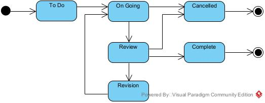

<h1>Sistem Task Management</h1>
 

        
    

<h2>Overview</h2>

Task Management merupakan aplikasi berbasis Python yang dikembangkan untuk membantu dalam manajemen proyek 
melalui pengelolaan tugas berdasarkan progres pengerjaan dari mulai hingga selesai.

<h2>Fitur</h2>

<h3>Manajemen Proyek</h3>
<ul>
  <li>Pengguna dapat membuat proyek baru dengan mengisi judul dan deskripsi proyek</li>
  <li>Pengguna dapat melihat seluruh daftar proyek maupun proyek tertentu dan tugas yang terkait</li>
  <li>Pengguna dapat menghapus proyek yang sudah tidak dibutuhkan atau sudah selesai</li>
</ul>

<h3>Manajemen Tugas</h3>
<ul>
  <li>Pengguna dapat menambahkan tugas ke dalam proyek</li>
  <li>Pengguna dapat melihat seluruh daftar tugas maupun daftar tugas dalam proyek pilihan</li>
  <li>Pengguna dapat menghapus tugas yang sudah tidak dibutuhkan</li>
  <li>Pengguna dapat mengubah status tugas berdasarkan progress pengerjaan</li>
</ul>

<h3>Tracking Status Tugas</h3>

Status yang digunakan dalam aplikasi ini meliputi:

<ul>
  <li><strong>To Do</strong> (belum dikerjakan)</li>
  <li><strong>Ongoing</strong> (sedang dikerjakan)</li>
  <li><strong>Review</strong> (dalam proses peninjauan)</li>
  <li><strong>Revision</strong> (memerlukan perbaikan)</li>
  <li><strong>Complete</strong> (selesai)</li>
  <li><strong>Cancelled</strong> (dibatalkan)</li>
</ul>

<h2>Alur Perubahan Status</h2>

Adapun flow perubahan status berdasarkan progress pengerjaan dijabarkan sebagai berikut:

  

<h2>Instalasi</h2>
<h3>Clone Repository</h3>
<pre>
git clone https://github.com/username/nama-repo.git
cd nama-repo
</pre>

<h3>Install Dependencies</h3>
<pre>
pip install -r requirements.txt
</pre>

<h3>Jalankan Aplikasi</h3>
<pre>
python main.py
</pre>

Setelah aplikasi dijalankan, akan muncul menu seperti berikut 

<pre>
=== TASK MANAGEMENT SYSTEM ===
1. Create Project
2. View Projects
...
</pre>

Jalankan fitur yang disediakan melalui input nomor pada fitur terkait (1,2,3...) 

<h2>Testing</h2>
<h3>Install Dependencies</h3>

Lakukan peng-installan pada dependencies apabila belum dimiliki :
<pre>
pip install -r requirements.txt
</pre>

<h3>Start Test</h3>

Jalankan testing melalui perintah :
<pre>
pytest tests/ --cov=app --cov-report=xml --cov-report=term-missing --cov-fail-under=60
</pre>

Perintah ini akan:

<ul>
    <li>Menjalankan seluruh test di folder tests/</li>
    <li>Menampilkan hasil test berupa report di terminal</li>
    <li>Generate file coverage.xml</code></li>
    <li>Gagal jika coverage di bawah 60%</li>
</ul>

<h3>Generate Report HTML</h3>
<pre>
pytest tests/ --cov=app --cov-report=html
</pre>

 Perintah ini akan generate hasil coverage report dalam bentuk folder htmlcov

 Untuk membaca hasil report, Buka file berikut di browser:

<pre>
htmlcov/index.html
</pre>

<h2>Strategi Pengujian</h2>

<h3>Unit Testing</h3>

  Unit test dilakukan dengan menggunakan mock sebagai pengganti koneksi database untuk melakukan pengujian dasar akan fungsi yang dibangun

    <ul>
        <li>Menggunakan <code>unittest.mock</code> untuk mock koneksi database</li>
        <li>Melakukan pengecekan fungsi, validasi input, dan edge case test</li>
        <li>Menguji logika bisnis seperti transisi status task</li>
    </ul>

<h3>Integration Testing</h3>
    

        Integration test dilakukan dengan menggunakan database SQLite nyata untuk menguji alur aplikasi secara nyata dalam proses bisnis tertentu.
    

    <ul>
        <li>Melakukan pengujian terhadap alur proses bisnis tertentu</li>
        <li>Menguji interaksi dan koneksi ke penyimpanan data</li>
        <li>Memastikan proses CRUD terhadap projek dan tugas berjalan semestinya</li>
    </ul>

<h3>Test Coverage</h3>
    

        Pengukuran persentase code yang telah di-testing dan memastikan angka persentase berada di atas 60%
    

